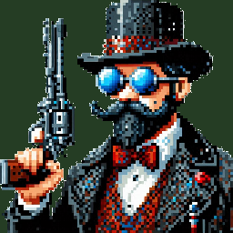

# Starter Kit FPS

This package includes a basic template for a first person shooter in Godot 4.3 (stable). Includes features like;

- Character controller
- Weapons, switching weapons
- Enemies
- Sprites and 3D Models _(CC0 licensed)_

### Controls

| Key | Command |
| --- | --- |
| <kbd>W</kbd> <kbd>A</kbd> <kbd>S</kbd> <kbd>D</kbd> | Movement |
| <kbd>Spacebar</kbd> | Jump |
| <kbd>Left mouse button</kbd> | Shoot |
| <kbd>E</kbd> | Switch weapon |

### License

MIT License
