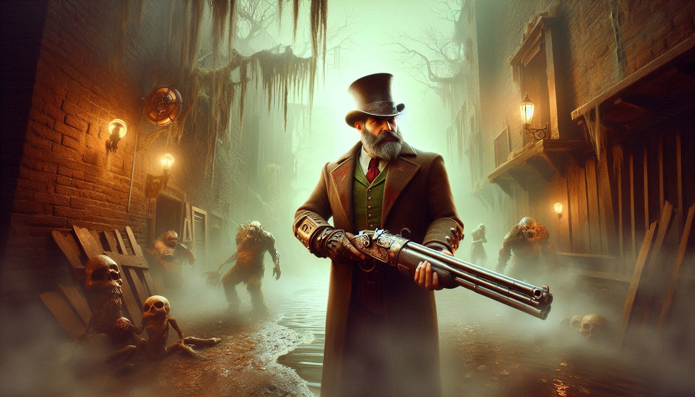

# Godot Steampunk Shooter

This is build from Kenney's FPS template for [Godot 4.3](https://godotengine.org/download) which features like;

- Character controller
- Weapons, switching weapons
- Enemies
- Sprites and 3D Models

### Controls

| Key                                                 | Command       |
| --------------------------------------------------- | ------------- |
| <kbd>W</kbd> <kbd>A</kbd> <kbd>S</kbd> <kbd>D</kbd> | Movement      |
| <kbd>Spacebar</kbd>                                 | Jump          |
| <kbd>Left mouse button</kbd>                        | Shoot         |
| <kbd>E</kbd>                                        | Switch weapon |

### License

MIT License

